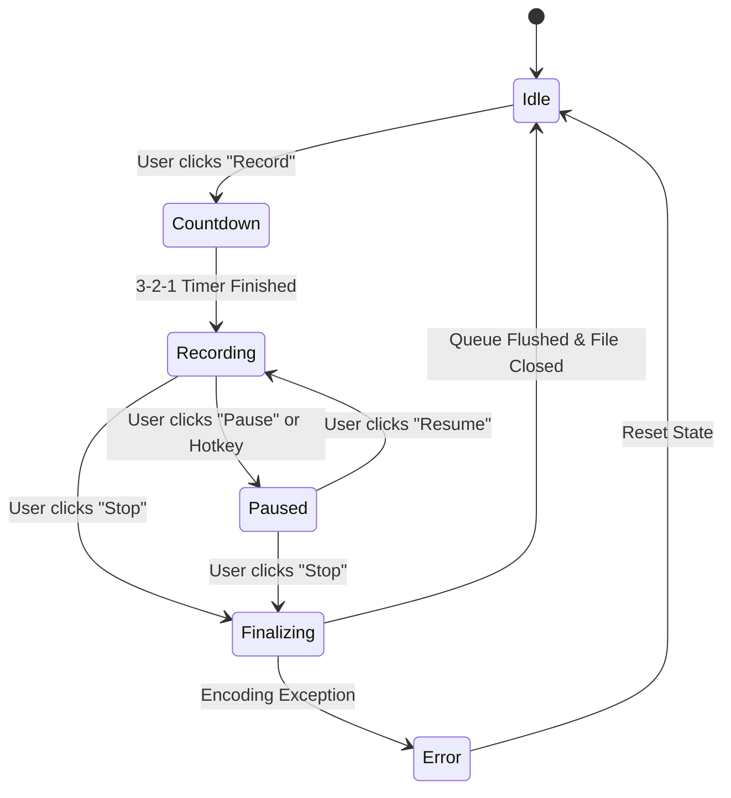

# 01. System Architecture & Threading Model

This document outlines the multi-threaded architecture, inter-thread communication pipelines, and A/V synchronization mechanisms for the Python GUI Screen Recorder.

---

## 1. High-Level System Architecture

```mermaid
flowchart TD
    subgraph UI_Layer ["Main / UI Thread (PyQt6)"]
        MainWindow["Main Window Dashboard"]
        Toolbar["Floating Control Toolbar"]
        RegionSelector["Region / Window Selection Overlay"]
        AnnotationCanvas["Live Annotation Overlay"]
        SettingsDialog["Settings & Audio Mixer Dialog"]
    end

    subgraph Core_Engine ["Core Recording Subsystem"]
        Controller["Recording Controller (State Machine)"]
        
        subgraph Capture_Threads ["Concurrent Capture Workers"]
            VideoWorker["Video Capture Thread\n(MSS / DXCam @ 30-120 FPS)"]
            AudioWorker["Audio Capture Thread\n(WASAPI Loopback + Mic @ 48kHz)"]
            WebcamWorker["Webcam Worker\n(OpenCV Camera Stream)"]
            InputWorker["Input Hook Worker\n(pynput Click/Key Overlay)"]
        end

        subgraph Queues ["Thread-Safe Ring Buffers"]
            VQ[("Video Frame Queue\n(Frames + Monotonic TS)")]
            AQ[("Audio Sample Queue\n(PCM Audio + Monotonic TS)")]
        end

        subgraph Encoding_Layer ["Encoding & Muxing Pipeline"]
            MuxerWorker["FFmpeg / PyAV Muxer Worker\n(Hardware NVENC/QSV/CPU)"]
            OutputFile[("Output Video File\n(.mp4 / .mkv / .webm)")]
        end
    end

    %% UI to Controller
    MainWindow -->|Start / Pause / Stop| Controller
    Toolbar -->|Quick Actions / Annotations| Controller
    RegionSelector -->|Target Bounding Box| Controller
    SettingsDialog -->|Codec / Bitrate / FPS / Devices| Controller

    %% Controller to Capture Threads
    Controller -->|Spawn & Synchronize| VideoWorker
    Controller -->|Spawn & Synchronize| AudioWorker
    Controller -->|Optional Overlay Stream| WebcamWorker
    Controller -->|Optional Input Tracking| InputWorker

    %% Capture to Queues
    VideoWorker -->|Push Frame (RGB/BGR + TS)| VQ
    AudioWorker -->|Push Audio Packet (Float32/Int16 + TS)| AQ
    WebcamWorker -.->|Composite onto Frame| VideoWorker
    InputWorker -.->|Draw Ripple/Keys| VideoWorker

    %% Queues to Muxer
    VQ -->|Pop & Encode Video| MuxerWorker
    AQ -->|Pop & Encode Audio| MuxerWorker
    MuxerWorker -->|Write Container Stream| OutputFile
```

---

## 2. Multi-Threading & Concurrency Rules

Desktop screen recording is a real-time, compute-heavy operation. Blocking the UI thread causes dropped frames, UI freezes, and audio desynchronization.

### 2.1 Thread Roles and Responsibilities

1. **Main Thread (UI & Event Loop)**:
   - Manages PyQt6 GUI, widgets, system tray, hotkey event listeners, and live overlays.
   - Must **NEVER** perform disk I/O, heavy image transformations, or audio blocking reads.
   - Communicates with the Recording Controller using PyQt `pyqtSignal` and `pyqtSlot`.

2. **Video Capture Worker (`threading.Thread` or `QThread`)**:
   - Continuously grabs desktop/window frames using high-speed native capture (`mss` or Windows `dxcam`).
   - Timestamps each frame using `time.perf_counter()`.
   - Composites optional overlays (mouse cursor, click ripples, keystroke HUD, webcam feed).
   - Enqueues frames into `VideoFrameQueue`.
   - Uses precision sleeping (`time.sleep` with busy-wait spin lock correction) to maintain exact target FPS.

3. **Audio Capture Worker**:
   - Uses `sounddevice.InputStream` with a non-blocking callback.
   - Captures **System Output** (WASAPI Loopback on Windows) and **Microphone Input** concurrently.
   - Normalizes and mixes both channels based on user-defined volume sliders.
   - Buffers PCM audio into `AudioSampleQueue` with corresponding monotonic timestamps.

4. **Encoding / Muxing Worker (`FFmpeg` Subprocess or `PyAV` Thread)**:
   - Consumes frames and audio packets from the queues.
   - Feeds raw video bytes to FFmpeg stdin (`rawvideo`, `bgr0`/`rgb24`) and raw audio bytes (`pcm_s16le` / `pcm_f32le`).
   - Handles container muxing into MP4/MKV.
   - Ensures `moov` atom is properly finalized on completion or handled using fragmented MP4 (`-movflags +frag_keyframe+empty_moov+default_base_moov` or `faststart`).

---

## 3. Audio / Video Synchronization Engine

A common pitfall in screen recorders is **A/V Drift** (audio leading or lagging video over long recordings).

### 3.1 Monotonic Timestamp Strategy

- The Recording Controller defines a global `t_start = time.perf_counter()`.
- Every video frame has an exact presentation timestamp:
  $$\text{PTS}_{video} = \text{time.perf_counter()} - t_{start}$$
- Every audio chunk has an exact sample-based PTS:
  $$\text{PTS}_{audio} = \frac{\text{total\_samples\_recorded}}{\text{sample\_rate}}$$

### 3.2 Dynamic Frame Rate & Frame Duplication / Dropping

If the system experiences CPU/GPU spikes and misses a screen capture cycle:
1. **Under-run (Capture lag)**: If $\Delta t > 1/\text{FPS}$, duplicate the previous frame with updated PTS to keep video stream clock continuous.
2. **Over-run (Queue accumulation)**: If `VideoFrameQueue.qsize() > MAX_CAPACITY` (e.g., 60 frames), drop intermediate frames and log a warning to prevent memory exhaustion.

---

## 4. State Machine & Lifecycle Transitions



### 4.1 State Definitions
- **Idle**: UI active, devices ready, zero background CPU load.
- **Countdown**: Fullscreen or floating 3-second animated countdown overlay (allows user to prepare).
- **Recording**: All capture workers active, queues flowing to muxer.
- **Paused**: Capture workers hold timestamps; audio/video clocks suspended; muxer pauses stream ingestion.
- **Finalizing**: Capture workers signal EOF; muxer drains remaining queued buffers, closes FFmpeg pipe, updates MP4 metadata index, and triggers UI notification.

---

## 5. Crash Resilience & File Protection

1. **Fragmented MP4 / Faststart**:
   - When writing MP4 files directly, sudden crashes can leave the `moov` atom unwritten, corrupting the entire recording.
   - Use `-movflags +faststart` upon completion, or record temporarily to MKV (which is crash-resistant) and remux to MP4 in 1-2 seconds after capture.
2. **Graceful Signal Handling**:
   - Intercept `SIGINT`, `SIGTERM`, and PyQt `closeEvent`.
   - Always run a 2-second timeout queue drain before terminating child processes.
